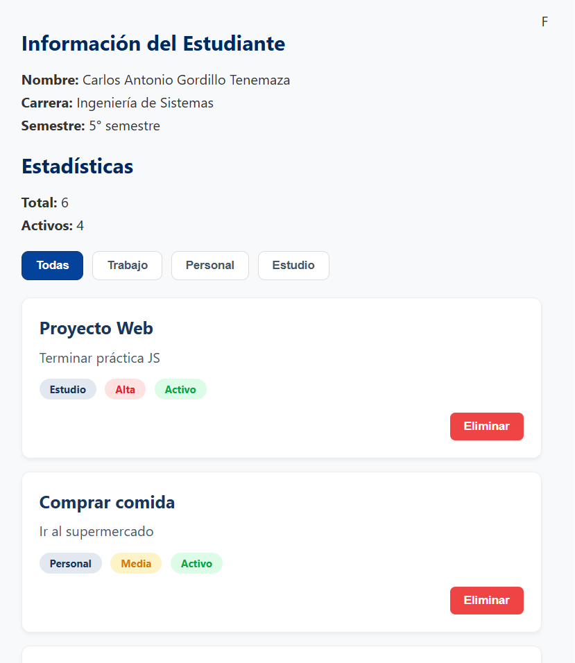

# Práctica 02: Manipulación Básica del DOM

## 📌 Información General

- **Título:** Práctica 02: Manipulación Básica del DOM
- **Asignatura:** Programación y Plataformas Web
- **Carrera:** Ingeniería en Computación
- **Estudiante:** Carlos Antonio Gordillo Tenemaza
- **Semestre:** 5to Semestre

---

## 🛠️ Descripción

Este proyecto consiste en una aplicación web interactiva desarrollada con HTML, CSS y JavaScript (JS). La solución permite gestionar una lista de tareas mediante la manipulación dinámica del Document Object Model (DOM), lo que facilita la actualización de la interfaz en tiempo real sin recargar la página. Implementa un sistema de renderizado que muestra información detallada de cada elemento (categoría, prioridad, estado) y ofrece funcionalidades para filtrar las tareas por categoría y eliminar elementos específicos de forma dinámica. Además, incluye la actualización automática de estadísticas generales conforme cambian los datos, mejorando la interacción y el control del usuario sobre la aplicación.

**Nota sobre la implementación y diseño:** El código base original carecía de vinculación y reglas de estilo. Como parte de la solución, se incluyó la etiqueta `<link rel="stylesheet" href="css/styles.css">` en el archivo `index.html` para enlazar correctamente la presentación. Además, se desarrolló desde cero el archivo `styles.css`, definiendo la tipografía, la paleta de colores y un diseño visual atractivo. Esto permite diferenciar claramente los estados de los botones de filtrado y las categorías de cada tarea, mejorando la experiencia de usuario.

---

## 🧑‍💻 Capturas de Pantalla

### Vista General (Sin Filtros)
Muestra la aplicación con la carga inicial de todos los datos y la estructura base.


### Vista con Filtrado Aplicado
Muestra la interfaz tras interactuar con los botones de categoría, reflejando el cambio de estilos y la reducción de elementos en el contenedor.



---

## 💻 Fragmentos de Código Relevantes

A continuación, se presentan los ejemplos de las funciones principales solicitadas en las especificaciones del proyecto:

### 1. Renderizado de la lista
Se utiliza `DocumentFragment` para optimizar la inserción de múltiples nodos en el DOM.

```javascript
function renderizarLista(datos) {
  const contenedor = document.getElementById('contenedor-lista');
  contenedor.innerHTML = '';

  const fragment = document.createDocumentFragment();
  datos.forEach(el => {
    const card = document.createElement('div');
    card.classList.add('card');
    
    const titulo = document.createElement('h3');
    titulo.textContent = el.titulo;
    
    card.appendChild(titulo);

    // ... (inserción del resto de elementos)

    fragment.appendChild(card);
  });

  contenedor.appendChild(fragment);
  actualizarEstadisticas();
}
```

### 2. Eliminación de elementos
Se localiza el elemento por su ID en el arreglo principal, se elimina con `splice` y se vuelve a renderizar la vista respetando el filtro activo.

```javascript
function eliminarElemento(id) {
  const index = elementos.findIndex(el => el.id === id);
  if (index !== -1) {
    elementos.splice(index, 1);
    
    const botonActivo = document.querySelector('.btn-filtro-activo');
    const categoriaActual = botonActivo ? botonActivo.dataset.categoria : 'todas';
    
    if (categoriaActual === 'todas') {
      renderizarLista(elementos);
    } else {
      const filtrados = elementos.filter(e => e.categoria === categoriaActual);
      renderizarLista(filtrados);
    }
  }
}
```

### 3. Filtrado
Manejo de eventos en los botones para filtrar el arreglo de elementos utilizando el atributo `data-categoria`.

```javascript
function inicializarFiltros() {
  const botones = document.querySelectorAll('.btn-filtro');
  botones.forEach(btn => {
    btn.addEventListener('click', () => {
      const categoria = btn.dataset.categoria;

      // Actualización de estilos en botones
      document.querySelectorAll('.btn-filtro').forEach(b => b.classList.remove('btn-filtro-activo'));
      btn.classList.add('btn-filtro-activo');

      // Lógica de filtrado
      if (categoria === 'todas') {
        renderizarLista(elementos);
      } else {
        const filtrados = elementos.filter(e => e.categoria === categoria);
        renderizarLista(filtrados);
      }
    });
  });
}
```