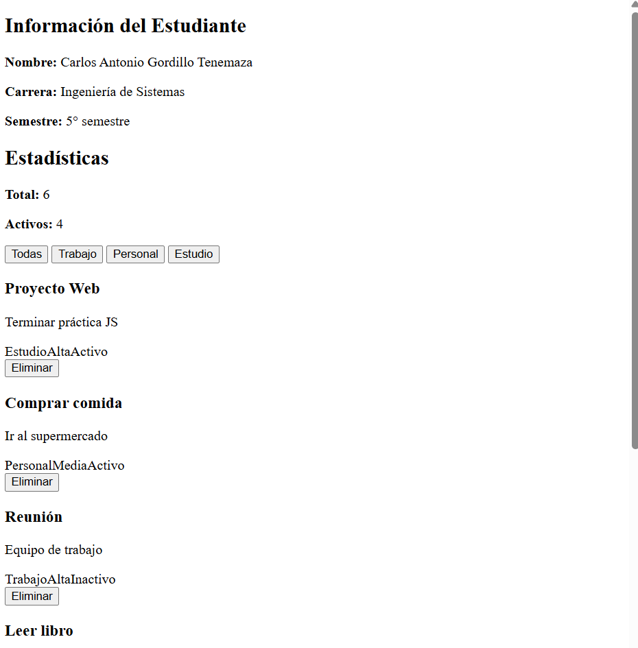

# Práctica 02 - Manipulación Básica del DOM

## 📌 Información General

- **Título:** Gestión de Tareas - DOM Básico
- **Asignatura:** Programación Web (Periodo 68)
- **Carrera:** Ingeniería en Computación
- **Estudiante:** Carlos Antonio Gordillo Tenemaza
- **Profesor:** [Nombre de tu profesor]

---

## 🛠️ Descripción Breve de la Solución

Este proyecto es una aplicación web interactiva desarrollada con **HTML5, CSS3 y Vanilla JavaScript** que permite gestionar una lista de actividades o tareas. La solución implementa la manipulación dinámica del DOM (Document Object Model) para leer, filtrar y eliminar elementos de un arreglo de datos en memoria, actualizando las vistas y estadísticas de la interfaz en tiempo real sin necesidad de recargar la página.

---

## 📸 Imágenes de la Aplicación

A continuación, se muestran las capturas de pantalla de la interfaz funcional de la aplicación:

### 1. Vista de la aplicación sin estilos

*Estructura HTML básica generada por JavaScript antes de aplicar los estilos visuales.*

### 2. Vista de la aplicación con estilos aplicados

*Interfaz final de la aplicación con el diseño CSS aplicado y el sistema de filtrado.*

---

## 💻 Fragmentos de Código Relevantes

```javascript
/* =========================================
   Estilos Generales (CSS)
========================================= */
body {
    font-family: -apple-system, BlinkMacSystemFont, "Segoe UI", Roboto, Helvetica, Arial, sans-serif;
    background-color: #f8f9fa;
    color: #333;
    margin: 0;
    padding: 20px;
    display: flex;
    justify-content: center;
}

#app { width: 100%; max-width: 600px; }
h2 { color: #1a365d; margin-bottom: 15px; }

.info-estudiante, .estadisticas { margin-bottom: 20px; }
.info-estudiante p, .estadisticas p { margin: 5px 0; font-size: 16px; }

.filtros { display: flex; gap: 10px; margin-bottom: 20px; }
.btn-filtro { background-color: #fff; border: 1px solid #ddd; padding: 8px 16px; border-radius: 8px; cursor: pointer; font-weight: bold; color: #4a5568; transition: all 0.2s ease; }
.btn-filtro:hover { background-color: #f1f5f9; }
.btn-filtro-activo { background-color: #1a365d; color: white; border-color: #1a365d; }
.btn-filtro-activo:hover { background-color: #2a4365; }

.card { background-color: white; border-radius: 10px; padding: 20px; margin-bottom: 15px; box-shadow: 0 2px 4px rgba(0,0,0,0.05); border: 1px solid #eee; }
.card h3 { color: #1a365d; margin: 0 0 10px 0; font-size: 20px; }
.card p { color: #4a5568; margin: 0 0 15px 0; }

.badges { display: flex; gap: 10px; margin-bottom: 15px; }
.badge { padding: 4px 12px; border-radius: 15px; font-size: 12px; font-weight: bold; }
.badge-categoria { background-color: #e2e8f0; color: #1a365d; }
.prioridad-alta { background-color: #fee2e2; color: #dc2626; }
.prioridad-media { background-color: #fef3c7; color: #d97706; }
.prioridad-baja { background-color: #dcfce7; color: #16a34a; }
.estado-activo { background-color: #dcfce7; color: #16a34a; }
.estado-inactivo { background-color: #f3f4f6; color: #6b7280; }

.card-actions { display: flex; justify-content: flex-end; }
.btn-eliminar { background-color: #ef4444; color: white; border: none; padding: 8px 16px; border-radius: 6px; cursor: pointer; font-weight: bold; transition: background-color 0.2s; }
.btn-eliminar:hover { background-color: #dc2626; }

/* =========================================
   Funciones Principales (JavaScript)
========================================= */
function renderizarLista(datos) {
  const contenedor = document.getElementById('contenedor-lista');
  contenedor.innerHTML = '';
  const fragment = document.createDocumentFragment();

  datos.forEach(el => {
    const card = document.createElement('div');
    card.classList.add('card');

    const titulo = document.createElement('h3');
    titulo.textContent = el.titulo;

    const descripcion = document.createElement('p');
    descripcion.textContent = el.descripcion;

    const categoria = document.createElement('span');
    categoria.textContent = el.categoria;
    categoria.classList.add('badge', 'badge-categoria');

    const prioridad = document.createElement('span');
    prioridad.textContent = el.prioridad;
    prioridad.classList.add('badge');
    if (el.prioridad === 'Alta') prioridad.classList.add('prioridad-alta');
    else if (el.prioridad === 'Media') prioridad.classList.add('prioridad-media');
    else prioridad.classList.add('prioridad-baja');

    const estado = document.createElement('span');
    estado.textContent = el.activo ? 'Activo' : 'Inactivo';
    estado.classList.add('badge');
    estado.classList.add(el.activo ? 'estado-activo' : 'estado-inactivo');

    const btnEliminar = document.createElement('button');
    btnEliminar.textContent = 'Eliminar';
    btnEliminar.classList.add('btn-eliminar');
    btnEliminar.addEventListener('click', () => eliminarElemento(el.id));

    const badges = document.createElement('div');
    badges.classList.add('badges');
    badges.appendChild(categoria);
    badges.appendChild(prioridad);
    badges.appendChild(estado);

    const acciones = document.createElement('div');
    acciones.classList.add('card-actions');
    acciones.appendChild(btnEliminar);

    card.appendChild(titulo);
    card.appendChild(descripcion);
    card.appendChild(badges);
    card.appendChild(acciones);

    fragment.appendChild(card);
  });

  contenedor.appendChild(fragment);
  actualizarEstadisticas();
}

function eliminarElemento(id) {
  const index = elementos.findIndex(el => el.id === id);
  if (index !== -1) {
    elementos.splice(index, 1);
    
    const botonActivo = document.querySelector('.btn-filtro-activo');
    const categoriaActual = botonActivo ? botonActivo.dataset.categoria : 'todas';
    
    if (categoriaActual === 'todas') {
      renderizarLista(elementos);
    } else {
      const filtrados = elementos.filter(e => e.categoria === categoriaActual);
      renderizarLista(filtrados);
    }
  }
}

function inicializarFiltros() {
  const botones = document.querySelectorAll('.btn-filtro');

  botones.forEach(btn => {
    btn.addEventListener('click', () => {
      const categoria = btn.dataset.categoria;

      document.querySelectorAll('.btn-filtro').forEach(b => b.classList.remove('btn-filtro-activo'));
      btn.classList.add('btn-filtro-activo');

      if (categoria === 'todas') {
        renderizarLista(elementos);
      } else {
        const filtrados = elementos.filter(e => e.categoria === categoria);
        renderizarLista(filtrados);
      }
    });
  });
}