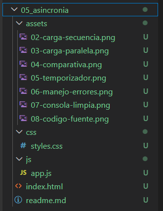
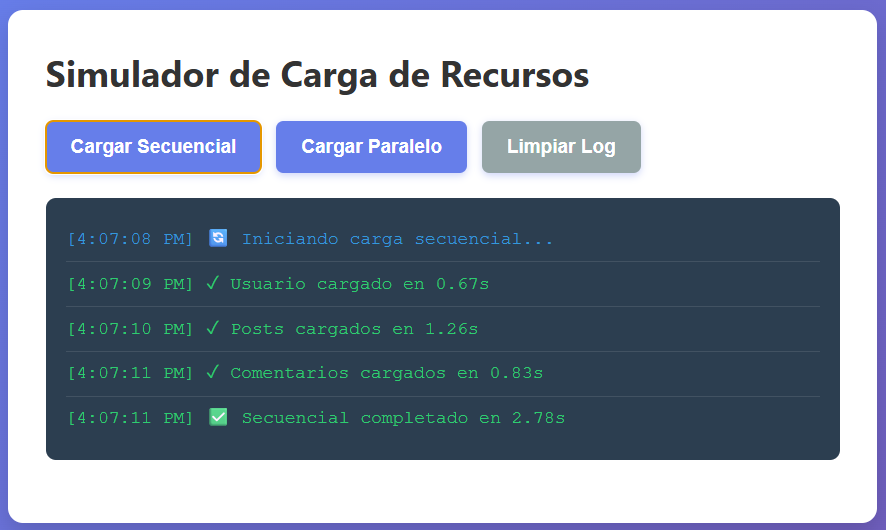
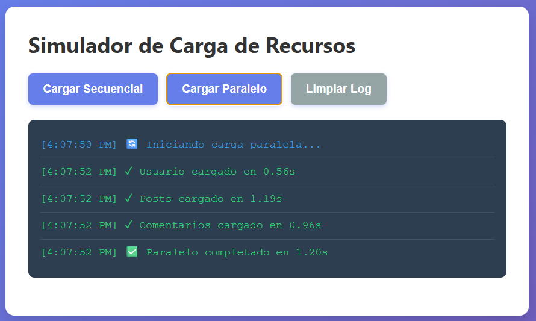
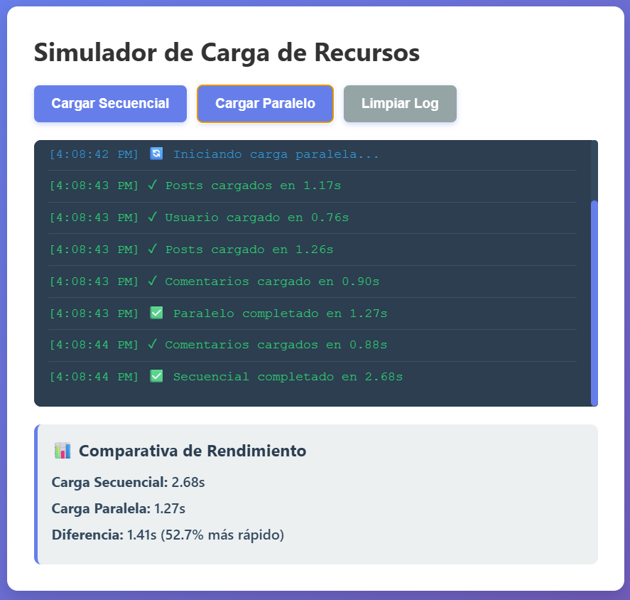
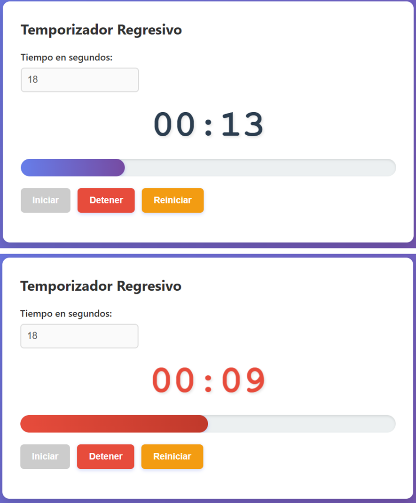
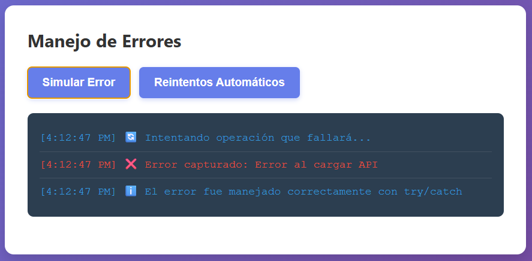
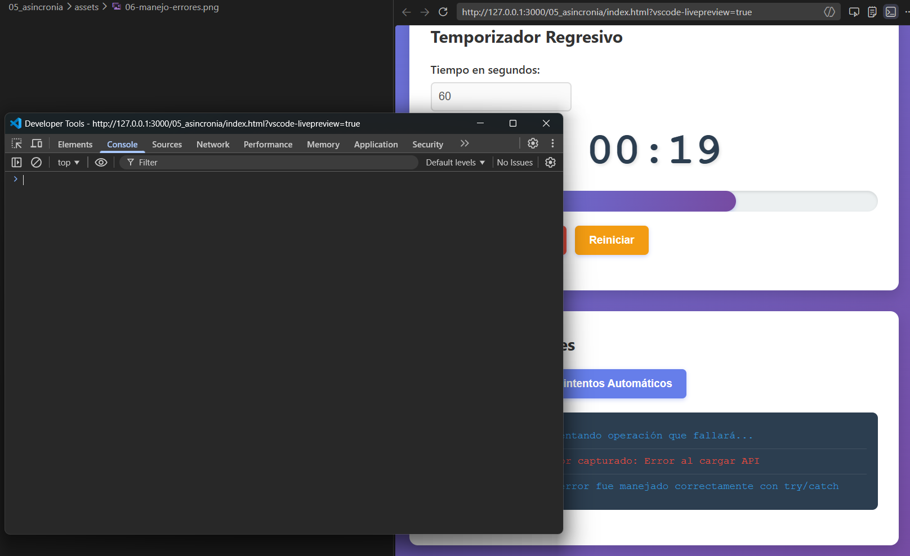
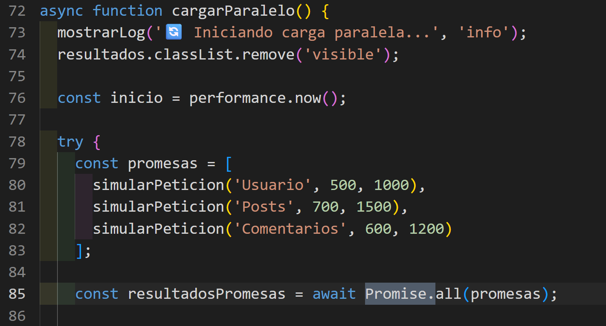

# Práctica 05: Programación Asíncrona

## 📌 Información General

- **Título:** Práctica 05: Programación Asíncrona
- **Asignatura:** Programación y Plataformas Web
- **Carrera:** Ingeniería en Computación
- **Estudiante:** Carlos Antonio Gordillo Tenemaza
- **Semestre:** 5to Semestre

---

## 🛠️ Descripción

Este proyecto es un simulador interactivo diseñado para demostrar y comparar los diferentes enfoques de la **programación asíncrona** en JavaScript. La aplicación permite visualizar en tiempo real cómo el Event Loop gestiona tareas que consumen tiempo, evitando que la interfaz de usuario se congele.

El proyecto está dividido en tres módulos funcionales:
1. **Simulador de Peticiones:** Compara el rendimiento entre la ejecución secuencial (`await` consecutivos) y la ejecución paralela (`Promise.all()`).
2. **Temporizador Regresivo:** Implementa `setInterval` y manipulación del DOM para crear una cuenta regresiva con barra de progreso y alertas visuales.
3. **Manejo de Errores:** Demuestra la captura segura de excepciones mediante bloques `try/catch` y un sistema de reintentos automáticos con backoff exponencial.

---

## 🧑‍💻 Capturas de Pantalla

### 1. Estructura del proyecto
**Descripción:** Explorador de archivos de Visual Studio Code mostrando la correcta organización del proyecto con sus directorios css, js, assets y el archivo principal index.html.




### 2. Carga secuencial
**Descripción:** Log mostrando las 3 peticiones ejecutándose una tras otra. El tiempo total es equivalente a la suma de los tiempos de espera individuales de cada promesa.




### 3. Carga paralela
**Descripción:** Log mostrando el uso de Promise.all para ejecutar las peticiones simultáneamente. Todas inician al mismo tiempo y terminan de forma mucho más eficiente.




### 4. Comparativa de tiempos
**Descripción:** Análisis de rendimiento que demuestra visualmente cómo la carga paralela resulta significativamente más rápida (generalmente más de un 50% de mejora) al tomar solo el tiempo del delay más largo, en contraste con la carga secuencial.



### 5. Temporizador en acción
**Descripción:** Temporizador regresivo en funcionamiento. Se observa la actualización del display en formato MM:SS y el cálculo matemático dinámico que reduce la barra de progreso cada segundo.




### 6. Manejo de errores
**Descripción:** Error capturado de forma controlada con un bloque try/catch y mostrado en la interfaz de usuario sin romper el flujo de la aplicación.



### 7. Consola limpia
**Descripción:** Herramientas de desarrollador (DevTools) comprobando que, gracias al correcto manejo de excepciones asíncronas, no se generan errores en color rojo en la consola del navegador.



### 8. Código fuente
**Descripción:** Evidencia del uso de buenas prácticas implementando la sintaxis moderna async/await y `Promise.all` en lugar del anidamiento tradicional con .`then()`.


---

## 💻 Fragmentos de Código Destacado

### 1. Función que retorna promesa con `setTimeout`
```javascript
function simularPeticion(nombre, tiempoMin = 500, tiempoMax = 2000, fallar = false) {
  return new Promise((resolve, reject) => {
    const tiempoDelay = Math.floor(Math.random() * (tiempoMax - tiempoMin + 1)) + tiempoMin;
    setTimeout(() => {
      if (fallar) reject(new Error(`Error al cargar ${nombre}`));
      else resolve({ nombre, tiempo: tiempoDelay, timestamp: new Date().toLocaleTimeString() });
    }, tiempoDelay);
  });
}
```

### 2. Carga Secuencial vs. Carga Paralela `(Promise.all)`
```javascript
// Secuencial: Espera a que termine una para iniciar la siguiente
const usuario = await simularPeticion('Usuario', 500, 1000);
const posts = await simularPeticion('Posts', 700, 1500);

// Paralela: Ejecuta todas simultáneamente
const promesas = [
  simularPeticion('Usuario', 500, 1000),
  simularPeticion('Posts', 700, 1500)
];
const resultadosPromesas = await Promise.all(promesas);
```

### 3. Temporizador con `setInterval`
```javascript
intervaloId = setInterval(() => {
  tiempoRestante--;
  actualizarDisplay();

  if (tiempoRestante <= 0) {
    detener();
    display.classList.add('alerta');
    alert('⏰ ¡Tiempo terminado!');
  }
}, 1000);
```

### 4. Manejo de errores con `try/catch`
```javascript
try {
  await simularPeticion('API', 500, 1000, true);
} catch (error) {
  mostrarLogError(`❌ Error capturado: ${error.message}`, 'error');
}
```


