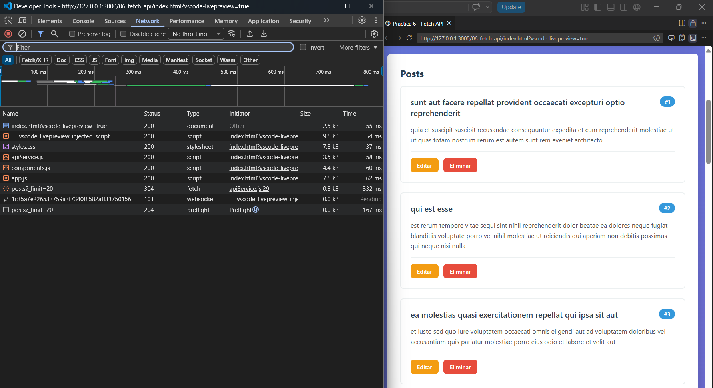
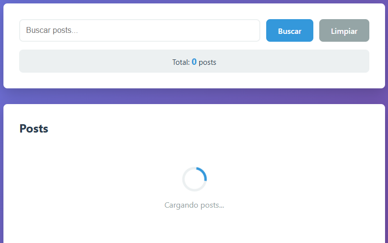
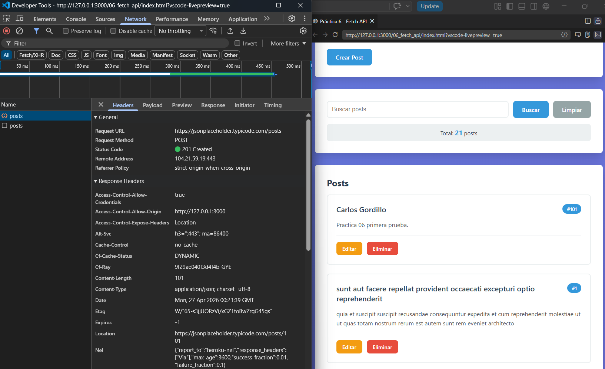
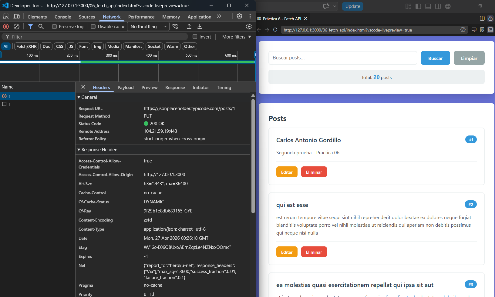
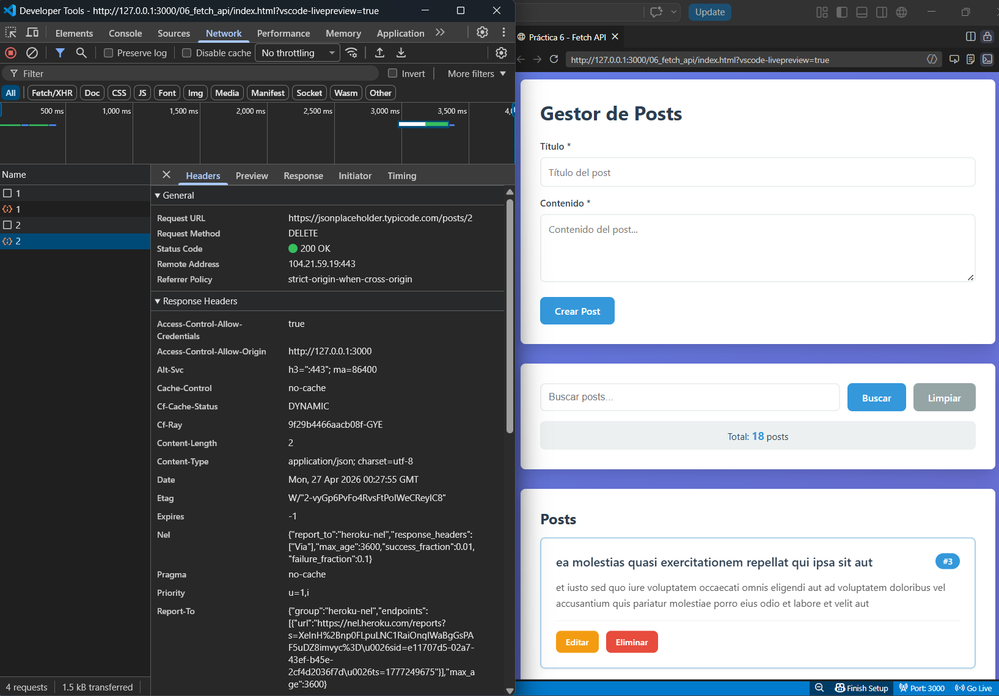
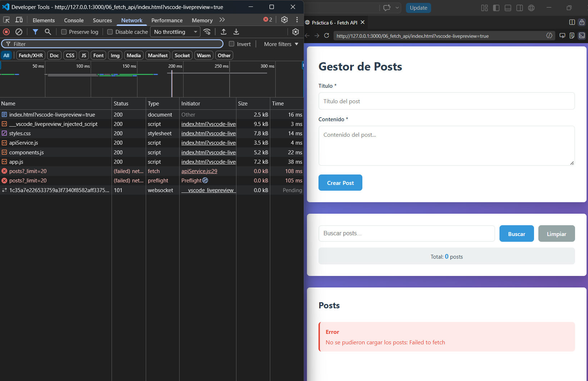
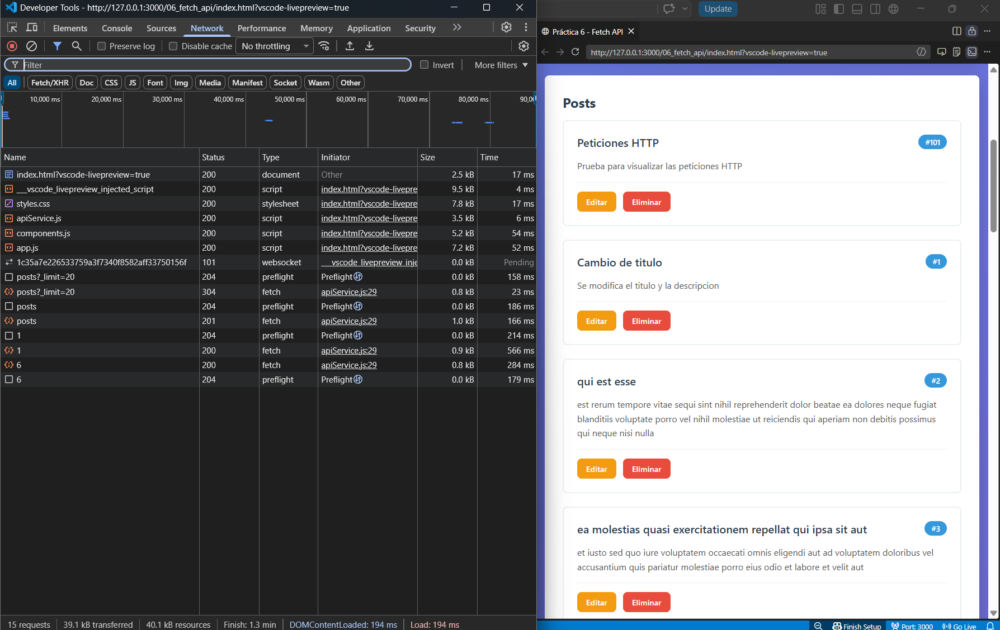
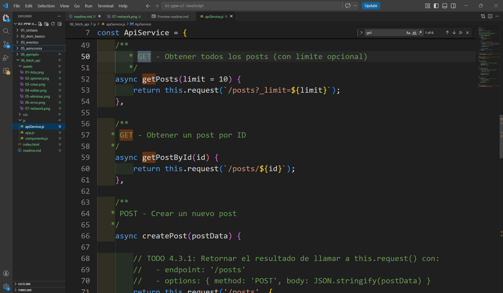

# Práctica 06: Fetch API y Consumo de Servicios

## 📌 Información General

- **Título:** Práctica 06: Fetch API y Consumo de Servicios
- **Asignatura:** Programación y Plataformas Web
- **Carrera:** Ingeniería en Computación
- **Estudiante:** Carlos Antonio Gordillo Tenemaza
- **Semestre:** 5to Semestre

---

## 🛠️ Descripción

Esta aplicación es un **Gestor de Posts** interactivo que consume la API REST de **JSONPlaceholder** para demostrar el manejo profesional de peticiones HTTP asíncronas en el navegador. 
La solución se enfoca en la seguridad y el rendimiento mediante los siguientes pilares:

1.  **Arquitectura Modular:** Separación de responsabilidades en capas claras: `ApiService.js` para la comunicación, `components.js` para la interfaz y `app.js` para la lógica de estado. 
2.  **Consumo de API REST:** Implementación completa del ciclo **CRUD** (Create, Read, Update, Delete) utilizando el método global `fetch()` y la sintaxis `async/await`. 
3.  **Seguridad contra XSS:** Construcción dinámica de la interfaz utilizando exclusivamente la **API del DOM** (`createElement`, `textContent`, `appendChild`), descartando el uso de `innerHTML` para datos provenientes del usuario para prevenir inyección de scripts. 
4.  **Experiencia de Usuario (UX):** Inclusión de estados de carga (Spinners), mensajes de error/éxito temporales y búsqueda reactiva local. 

---

## 💻 Fragmentos de Código Destacado

### 1. Método genérico de petición con validación de `response.ok`
Centraliza las peticiones HTTP, configura headers por defecto y maneja manualmente los errores HTTP, ya que `fetch` no rechaza la promesa en respuestas 4xx o 5xx.

```javascript
async request(endpoint, options = {}) {
  const url = `${this.baseUrl}${endpoint}`;
  const response = await fetch(url, {
    headers: { 'Content-Type': 'application/json', ...options.headers },
    ...options
  });
  
  // fetch NO lanza error en 404/500, se debe validar manualmente
  if (!response.ok) throw new Error(`HTTP Error: ${response.status}`); 
  return response.status === 204 ? null : await response.json(); 
}
```

### 2. Construcción segura de componentes (Sin innerHTML)
Evita vulnerabilidades XSS al construir la interfaz estrictamente con la API del DOM. Al usar `textContent`, el navegador trata los datos recibidos como texto plano y no como código ejecutable.

```javascript
function PostCard(post) {
  const article = document.createElement('article'); 
  const title = document.createElement('h3');
  
  // textContent es seguro contra XSS porque no interpreta HTML
  title.textContent = post.title; 
  
  article.appendChild(title); 
  return article; // Retorna un objeto HTMLElement real 
}
```

### 3. Creación y actualización con lógica de estado
Maneja inteligentemente si la operación es un POST o un PUT basándose en el estado global. Además, actualiza inmediatamente el array local para mantener sincronizada la interfaz sin saturar al servidor con nuevas peticiones.

```javascript
if (modoEdicion) {
  // Modo PUT
  resultado = await ApiService.updatePost(id, datosPost);
  const index = posts.findIndex(p => p.id === id);
  posts[index] = { ...resultado, id };
} else {
  // Modo POST
  resultado = await ApiService.createPost(datosPost); 
  posts.unshift(resultado); // Agrega al inicio para visibilidad inmediata 
}
```

### 4. Delegación de eventos para optimización del DOM
En lugar de asignar un Event Listener a cada botón individualmente, se asigna uno solo al contenedor padre (listaPosts). Esto optimiza la memoria y permite capturar eventos de tarjetas que se crean y eliminan dinámicamente.

```javascript
listaPosts.addEventListener('click', (e) => {
  const action = e.target.dataset.action;
  if (!action) return;

  const id = parseInt(e.target.dataset.id);
  const post = posts.find(p => p.id === id);

  if (action === 'editar' && post) {
    activarModoEdicion(post);
  }

  if (action === 'eliminar') {
    eliminarPost(id);
  }
});
```

---

## 🧑‍💻 Capturas de Pantalla

### 1. Lista cargada - Datos de la API renderizados en la página
**Descripción:** Se obtienen los registros desde la API mediante una petición GET exitosa y se construyen las tarjetas utilizando la API del DOM para mostrar la información de forma dinámica.


### 2. Spinner - Estado de carga visible
**Descripción:** Componente visual que se muestra en pantalla mientras la petición asíncrona está en proceso, evitando una pantalla vacía y mejorando la retroalimentación hacia el usuario.


### 3. Crear - Formulario enviado
**Descripción:** Evidencia del nuevo post insertado dinámicamente al inicio de la lista tras procesar exitosamente una petición POST al servidor.


### 4. Editar - Ítem modificado visible
**Descripción:** La tarjeta del post refleja los nuevos datos ingresados en el formulario tras realizar la petición PUT para actualizar el recurso de manera completa.


### 5. Eliminar - Ítem removido
**Descripción:** El post desaparece de la interfaz y el contador total se actualiza inmediatamente después de la confirmación del usuario y una petición DELETE exitosa.


### 6. Error - Mensaje de error al fallar una petición
**Descripción:** Visualización de un componente de error directamente en la interfaz cuando ocurre un problema de red o falla la petición HTTP, asegurando que el usuario esté informado.


### 7. DevTools Network - Pestaña Network mostrando las peticiones HTTP
**Descripción:** Inspección de las herramientas de desarrollador verificando el correcto envío de cabeceras, el cuerpo de las peticiones y los códigos de estado RESTful correspondientes.


### 8. Código - Capturas del servicio API y componentes
**Descripción:** Fragmentos clave del código fuente que evidencian el uso estricto de `async/await` y la construcción segura de elementos HTML sin el uso de `innerHTML`.
