# Práctica 08: Formularios y Validación

## 📌 Información General

- **Título:** Práctica 08: Formularios y Validación
- **Asignatura:** Programación y Plataformas Web
- **Carrera:** Ingeniería en Computación
- **Estudiante:** Carlos Antonio Gordillo Tenemaza
- **Semestre:** 5to Semestre

---

## 🛠️ Descripción

Este proyecto consiste en el desarrollo de un sistema de registro de usuarios interactivo, centrado en la **validación de datos en el lado del cliente** utilizando JavaScript puro (Vanilla JS).
La aplicación permite asegurar la integridad de la información antes de su procesamiento, mejorando la experiencia del usuario mediante retroalimentación visual inmediata y previniendo errores comunes de entrada.

El proyecto se divide en tres pilares fundamentales:
1. **Validación de Datos:** Uso de expresiones regulares (Regex) y la API de validación de HTML5 para verificar formatos de correo, teléfono y complejidad de contraseñas.
2. **Manipulación del DOM:** Generación dinámica y segura de mensajes de error y tarjetas de resultados mediante `createElement` y `textContent`, evitando vulnerabilidades XSS.
3. **Persistencia y UX:** Implementación de autoguardado con `sessionStorage` para mantener borradores y aplicación de máscaras de entrada en tiempo real para campos específicos.

---

## 💻 Fragmentos de Código Destacado

### 1. Validación con Expresiones Regulares (Regex)
```javascript
const REGEX = {
  email: /^[^\s@]+@[^\s@]+\.[^\s@]+$/,
  telefono: /^\d{10}$/,
  soloLetras: /^[a-zA-ZáéíóúÁÉÍÓÚñÑ\s]+$/,
  password: /^(?=.*[a-z])(?=.*[A-Z])(?=.*\\d).{8,}$/
};

// Ejemplo de validación de nombre
if (nombre === 'nombre' && !REGEX.soloLetras.test(valor)) {
  error = 'El nombre solo puede contener letras y espacios';
}
```

### 2. Creación Segura de Componentes (Prevención XSS)
```javascript
function MensajeError(mensaje) {
  const container = document.createElement('div');
  container.className = 'mensaje-error';

  const titulo = document.createElement('strong');
  titulo.textContent = '✗ Error';

  const texto = document.createElement('p');
  texto.textContent = mensaje;

  container.appendChild(titulo);
  container.appendChild(texto);
  return container;
}
```

### 3. Autoguardado con sessionStorage
```javascript
const STORAGE_KEY = 'form_borrador';

formRegistro.addEventListener('input', () => {
  const datos = Object.fromEntries(new FormData(formRegistro));
  datos.terminos = document.querySelector('#terminos').checked;
  sessionStorage.setItem(STORAGE_KEY, JSON.stringify(datos));
});
```

### 4. Captura de Datos con FormData
```javascript
formRegistro.addEventListener('submit', (e) => {
  e.preventDefault();
  if (ValidacionService.validarFormulario(formRegistro)) {
    const formData = new FormData(formRegistro);
    const datos = Object.fromEntries(formData);
    console.log('Datos a enviar:', datos);
  }
});
```

## 🧑‍💻 Capturas de Pantalla

### 1. Formulario vacío - Vista inicial
**Descripción:** Interfaz inicial del formulario. Se comprueba que el botón "Registrarse" se mantiene deshabilitado mediante JavaScript hasta que el usuario llene todos los campos obligatorios.

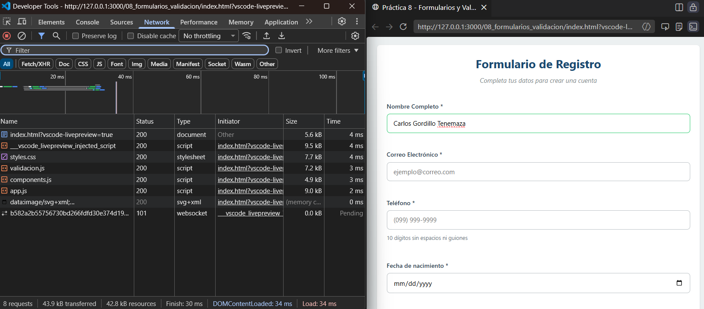

### 2. Errores de validación
**Descripción:** Muestra del feedback visual negativo. Al detectar formatos incorrectos o campos vacíos, se inyectan mensajes de error dinámicos en el DOM y se aplica el borde rojo `(.campo--error).`

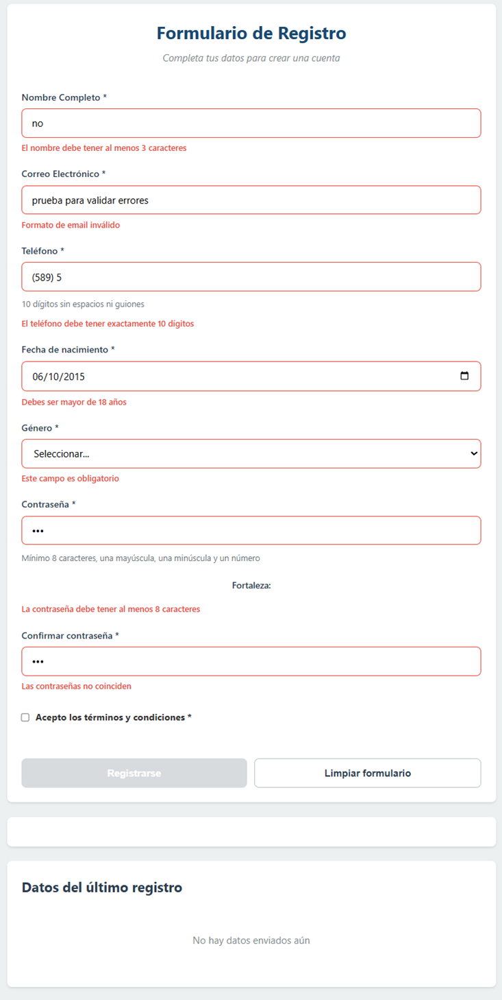

### 3. Campos válidos
**Descripción:** Validación exitosa de los campos en tiempo real tras evaluarlos con expresiones regulares (Regex). Se aplica el borde verde `(.campo--valido)` para confirmar que el formato es correcto.

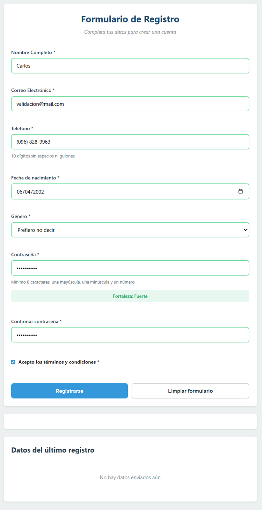

### 4. Indicador de fuerza de contraseña
**Descripción:** Evaluación dinámica de la seguridad de la clave. El indicador cambia visualmente (Débil, Media, Fuerte) dependiendo de la longitud y la combinación de caracteres ingresados.

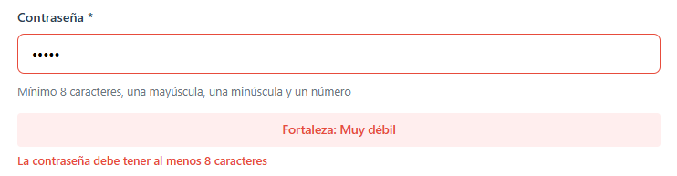

### 5. Error de contraseñas no coinciden
**Descripción:** Validación cruzada entre ambos campos de contraseña. Si los valores no son idénticos, se bloquea el formulario y se muestra un mensaje de error específico alertando al usuario.

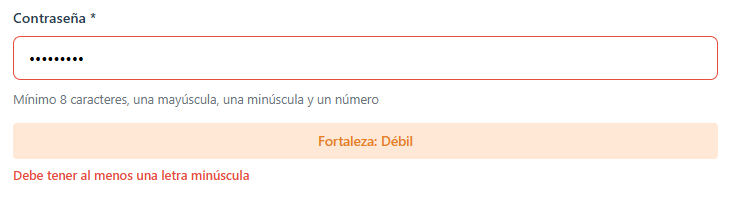

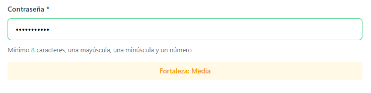

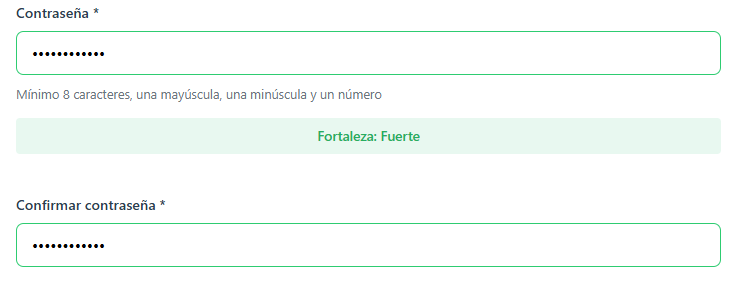

### 6. Máscara de teléfono
**Descripción:** Demostración de la función de formateo automático que aplica el estilo (099) 999-9999 mientras el usuario escribe.

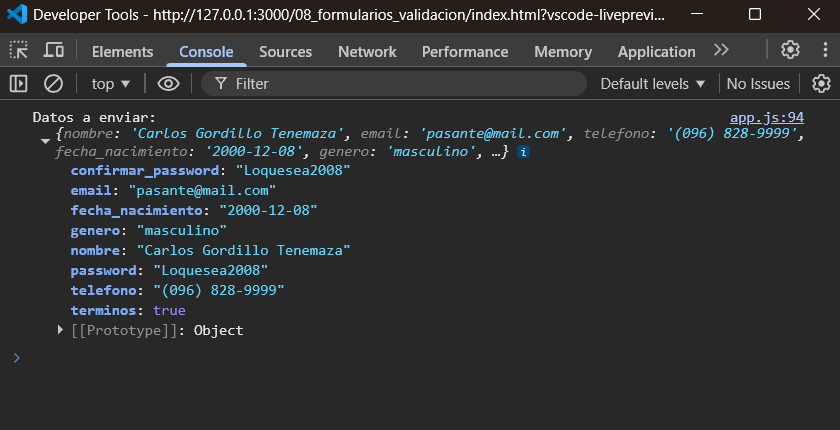

### 7. Envío exitoso
**Descripción:** Notificación visual de éxito y generación de la tarjeta de resultados tras interceptar el evento de envío.


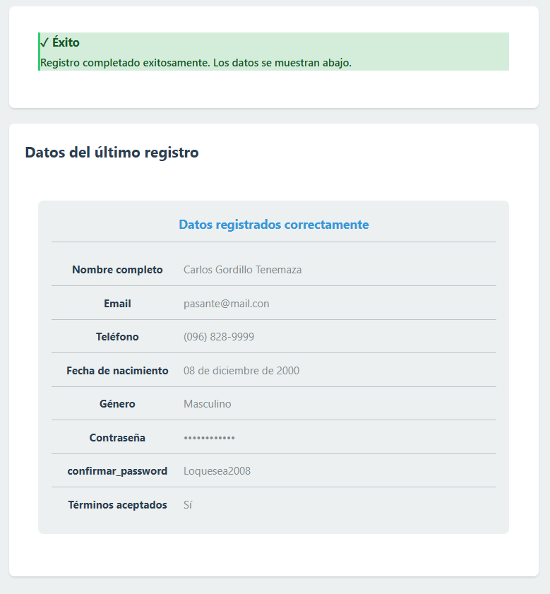

### 8. Tarjeta de resultado
**Descripción:** Componente ResultadoCard generado dinámicamente. Muestra los datos recopilados aplicando formatos de seguridad (contraseña oculta), fechas legibles y traducción de valores. Además, se puede observar los datos formateados correctamente

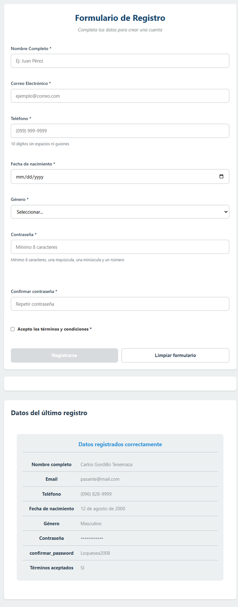

### 9. Consola - Datos impresos al enviar
**Descripción:** Evidencia en las herramientas de desarrollador mostrando el objeto JSON procesado correctamente por la API FormData.

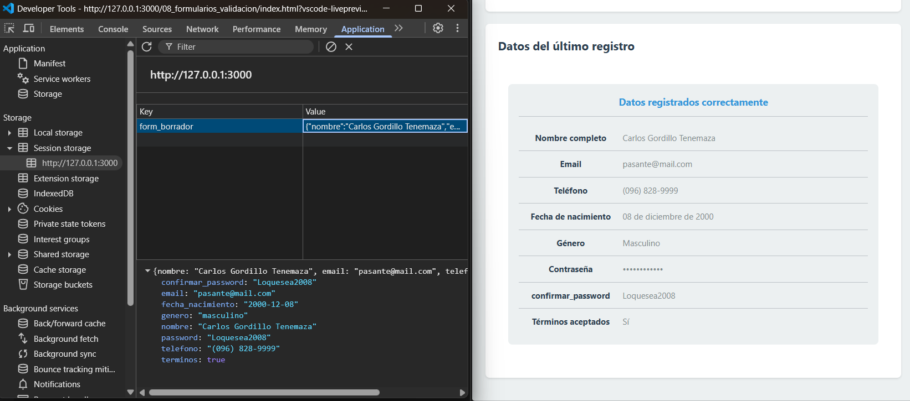

### 10. Código fuente
**Descripción:** Captura de la organización modular del proyecto en Visual Studio Code, incluyendo validacion.js y components.js.

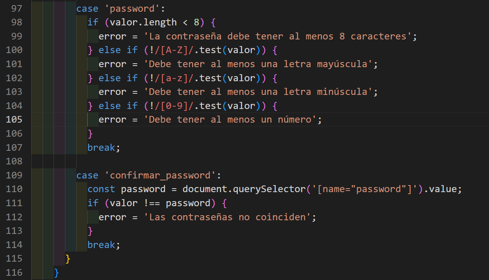

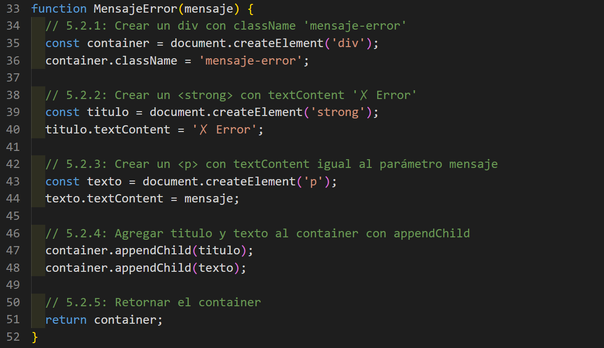